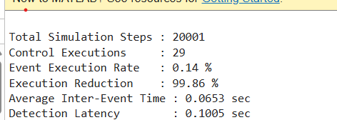

## Event-Triggered Real-Time Monitoring and Fault Detection System using STM32

## Overview

This project demonstrates the design, simulation, and embedded implementation of an Event-Triggered Monitoring and Fault Detection System.
The workflow begins with MATLAB-based validation of an event-triggered monitoring strategy and is subsequently deployed on an STM32F412ZG microcontroller using Embedded C.

Unlike conventional periodic execution, computations are performed only when significant changes occur, reducing unnecessary processing while maintaining monitoring and fault detection performance.

---

## Project Workflow

```text
MATLAB Simulation
        ↓
Event Trigger Validation
        ↓
Disturbance Injection
        ↓
Performance Analysis
        ↓
STM32 Deployment
        ↓
Real-Time Monitoring
        ↓
Fault Detection & State Indication
```

---

# MATLAB Validation

The event-triggered algorithm was first validated in MATLAB using a state-space plant model with communication delay and injected disturbances.

## Simulation Features

- Event-triggered control
- Periodic control comparison
- Communication delay modelling
- Disturbance injection
- Fault monitoring
- Event execution statistics
- Inter-event interval analysis

## System Parameters

| Parameter | Value |
|------------|---------|
| Sampling Time | 100 µs |
| Simulation Time | 2 s |
| Communication Delay | 5 ms |
| Trigger Threshold | 0.04 |
| Disturbance Time | 1 s |

---

## MATLAB Results

| Metric | Value |
|----------|---------|
| Total Simulation Steps | 20,001 |
| Control Executions | 29 |
| Event Execution Rate | 0.14 % |
| Average Inter-Event Time | 65 ms |
| Detection Latency | 100 ms |

The event-triggered controller successfully maintained system stability while requiring significantly fewer control updates than a conventional periodic controller.

---

## Event Triggering Behaviour


---

## Event-Triggered vs Periodic Control


---

## Inter-Event Intervals


---

## Event Distribution


---

## System Health Monitoring


---

## Fault Detection Timeline


---

## MATLAB Results Summary



---

# STM32 Hardware Implementation

The validated MATLAB event-triggered monitoring algorithm was deployed on an STM32F412ZG microcontroller using STM32CubeMX, Keil MDK, and Embedded C.

## Hardware and Software Platform

| Component | Description |
|------------|------------|
| Microcontroller | STM32F412ZG |
| Development Environment | Keil MDK |
| Configuration Tool | STM32CubeMX |
| Programming Interface | ST-Link |
| Serial Monitoring | PuTTY |
| Language | Embedded C |

---

## Implemented Features

- Internal temperature sensor acquisition
- Event-triggered scheduling
- Temperature change detection (ΔT)
- Moving average computation
- Variance estimation
- Fault detection logic
- Fault occurrence counting
- UART-based real-time monitoring
- CPU utilization reduction analysis

---

## Real-Time Monitoring Variables

| Variable | Description |
|-----------|-------------|
| temperature | Measured internal temperature |
| deltaT | Temperature variation between samples |
| moving_avg | Running average temperature |
| variance | Temperature variance |
| event_count | Number of triggered events |
| event_rate | Percentage of event-triggered executions |
| cpu_reduction | Estimated CPU utilization reduction |
| window_cpu_reduction | CPU reduction over observation window |
| fault_count | Total detected faults |
| system_state | Current operating state |

---

## STM32 Experimental Results

| Metric | Value |
|---------|---------|
| Event Count | 24 |
| Event Rate | 21.81 % |
| CPU Reduction | 78.18 % |
| Window CPU Reduction | 81 % |
| Fault Count | 4 |
| System State | Normal Operation |

The embedded implementation demonstrates that event-triggered execution can significantly reduce computational activity while maintaining continuous monitoring and fault detection capability.

---

## STM32 Runtime Results


---

## Embedded Workflow

```text
MATLAB Design
      ↓
Algorithm Validation
      ↓
Performance Analysis
      ↓
Embedded C Implementation
      ↓
STM32 Deployment
      ↓
UART Monitoring
      ↓
Real-Time Fault Detection
```

---

## Repository Structure

```text
STM32-EVENT-TRIGGERED-FAULT-DETECTION
│
├── MATLAB/
│   └── event_triggered.m
│
├── STM32_Keil/
│   ├── Core/
│   └── EventTriggered_Int.ioc
│
├── Results.png
├── Event Triggering condition with disturbance.png
├── Event Triggered VS Periodic Control.png
├── Inter_event intervals.png
├── Event Distribution over time.png
├── System Health Monitoring.png
├── Fault Detection Timeline.png
├── stm32_runtime_results.png
│
└── README.md
```

---

## Tools and Technologies

- MATLAB
- STM32CubeMX
- Keil MDK
- Embedded C
- UART Communication
- PuTTY
- Event-Triggered Monitoring
- Fault Detection
- Real-Time Embedded Systems

---

## Future Improvements

- External sensor integration
- TinyML-based anomaly detection
- CAN communication support
- FreeRTOS integration
- Real-time dashboard visualization

---

## Author

Ketan Bathla  
M.Tech Cyber-Physical Systems  
Indian Institute of Technology Jodhpur
